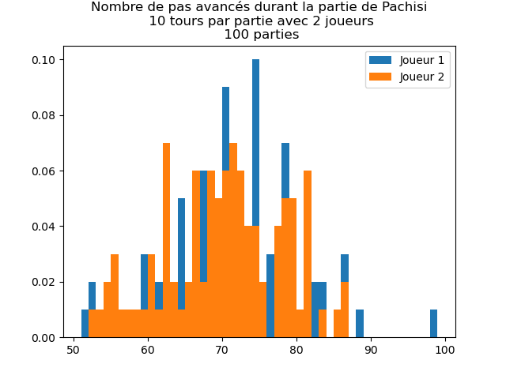
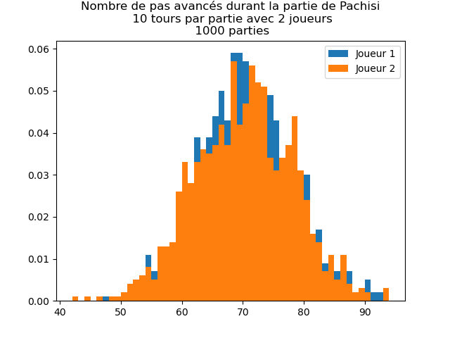

# Distribution des résultats de lancers de dés

Ce projet présente les distributions des résultats de lancers de dés pour différents nombres de jeux.

## Plots

- **`plot_diceroll_distribution_5_games.png`** : Distribution des résultats de lancers de dés pour 5 jeux.
  
  

- **`plot_diceroll_distribution_10_games.png`** : Distribution des résultats de lancers de dés pour 10 jeux.
  
  

- **`plot_diceroll_distribution_100_games.png`** : Distribution des résultats de lancers de dés pour 100 jeux.
  
  

- **`plot_diceroll_distribution_1000_games.png`** : Distribution des résultats de lancers de dés pour 1000 jeux.
  
  

- **`plot_diceroll_distribution_10000_games.png`** : Distribution des résultats de lancers de dés pour 10000 jeux.
  
  
